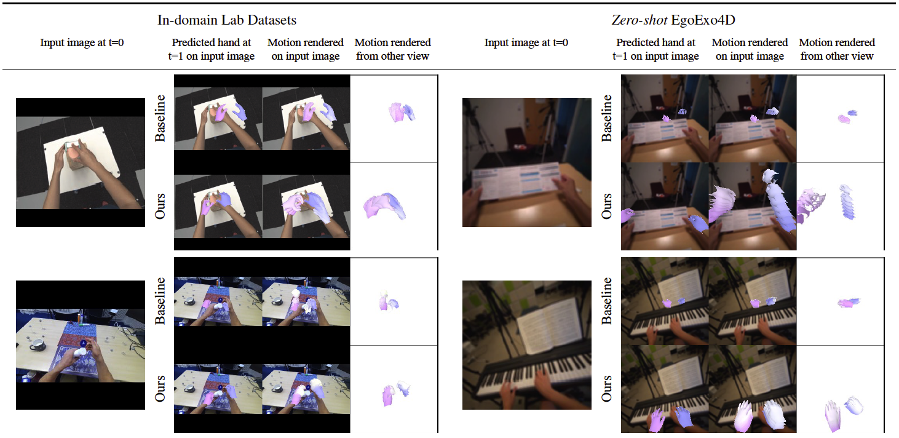
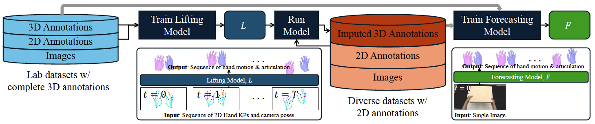

# Bimanual 3D Hand Motion and Articulation Forecasting in Everyday Images

## [Project Page](https://ap229997.github.io/projects/forehand4d) | [Paper](https://ap229997.github.io/projects/forehand4d/assets/paper.pdf) | [Supplementary](https://ap229997.github.io/projects/forehand4d/assets/suppmat.pdf) | [Video](https://youtu.be/lPv5FbgD-LU) | [Poster]()

This work develops ForeHand4D, a system for forecasting bimanual 3D hand motion from a single everyday RGB image as input. ForeHand4D can operate on diverse everyday images to output the full articulation of the hand in 3D for both hands over long time horizons while only requiring a single RGB image.

<p align="center">
  
</p>

Pipeline:
<p align="center">
  
</p>

If you find our code or paper useful, please cite
```bibtex
@misc{Prakash2025ForeHand4D,
                author = {Prakash, Aditya and Forsyth, David and Gupta, Saurabh},
                title = {Bimanual 3D Hand Motion and Articulation Forecasting in Everyday Images},
                howpublished = {https://github.com/ap229997/forehand4d},
                year = {2025}
            }
```

## Setup

```
conda create --name forecast python=3.10
conda activate forecast

conda install pytorch==2.4.1 torchvision==0.19.1 torchaudio==2.4.1 pytorch-cuda=12.4 -c pytorch -c nvidia
conda install -c fvcore -c iopath -c conda-forge fvcore iopath
conda install -c bottler nvidiacub

pip install -r requirements.txt
```

The dataloaders and models also requires the [MANO]((https://mano.is.tue.mpg.de)) and [SMPL](https://smpl.is.tue.mpg.de/) body models. Please visit their respective websites and register to get access to the models. Put these models in `body_models` folder in the directory structure below. While our model does not require SMPL/SMPLX models, some of the baseline codebases load these models.

We use several datasets for training and evaluation. Please download them from their respective websites: [ARCTIC](https://arctic.is.tue.mpg.de/), [AssemblyHands](https://assemblyhands.github.io/), [DexYCB](https://dex-ycb.github.io/), [H2O3D](https://github.com/shreyashampali/ho3d), [H2O](https://taeinkwon.com/projects/h2o/), [EgoExo4D](https://ego-exo4d-data.org/), [VISOR](https://epic-kitchens.github.io/VISOR/), [HoloAssist](https://holoassist.github.io/), [HOT3D](https://facebookresearch.github.io/hot3d/). The directory structure should look like below.

The motion splits for different datasets and pretrained forecasting model are available [here](https://drive.google.com/drive/folders/1H3T-Zny4Nw1PBInYg-pz-GDSwlsgvRgn?usp=sharing). We also use the [HaMeR](https://github.com/geopavlakos/hamer) pretrained model for initializing the encoder.

```
├── downloads
│   ├── data
│       ├── arctic
│       ├── assembly
│       ├── h2o
│       ├── ...
│   ├── model
│       ├── body_models
│           ├── mano
│           ├── smpl
│           ├── smplx
│       ├── forehand4d
│       ├── hamer # used for initializing encoder
│   ├── motion_splits
│       ├── arctic
│       ├── assembly
│       ├── h2o
│       ├── ...

```

Set the environment variable to point to the downloads directory. The paths for loading all datasets and models are set relative to this directory.:
```bash
export DOWNLOADS_DIR=<path_to_downloads_directory>
```

## Demo

The pretrained forecasting model checkpoint is provided in `downloads/model/forehand4d` in the directory structure above. 

Check `demo.ipynb` for instructions on running the demo.


## Training

### Training the forecasting model
We follow a two-stage training procedure since the imputed 3D labels are noisy. Training from scratch on these noisy labels leads to training stability issues. Refer to the config files in `src/parsers/configs` for different training parameters for different models. Make sure that the inference parameters are commented out in the config files for training.

First, we train on clean labels from lab datasets (ARCTIC, H2O, H2O3D, DexYCB, HOT3D). Update the config file `src/parsers/configs/mdm.py` to use `DEFAULT_ARGS_EGO['dataset'] = 'arctic_ego+h2o+h2o3d+dexycb+hot3d'` and `DEFAULT_ARGS_EGO['val_dataset'] = 'arctic_ego+h2o+dexycb+hot3d'`. We do not use H2O3D for validation since it has very few sequences. Also, uncomment the data augmentation terms: `rot_factor`, `noise_factor` and `scale_factor` in the same config file.
```
CUDA_VISIBLE_DEVICES=<GPU_IDS> python scripts_method/train.py --method mdm_light --exp_key forehand4d_stage1
```

Then, we finetune jointly on both lab datasets and imputed labels (estimated by our lifting model) from in-the-wild datasets (AssemblyHands, HoloAssist). Set `DEFAULT_ARGS_EGO['dataset'] = 'arctic_ego+h2o+h2o3d+dexycb+hot3d+assembly+holo'` and uncomment `finetune_2d`, `finetune_3d`, `grad_clip` in the config file. We load the checkpoint from stage 1 training and finetune for 20 epochs.

```
CUDA_VISIBLE_DEVICES=<GPU_IDS> python scripts_method/train.py --method mdm_light --exp_key forehand4d_stage2 --load_ckpt logs/forehand4d_stage1/checkpoints/last.ckpt --num_epoch 20 --eval_every_epoch 1
```

### Training the lifting model

The lifting model uses 2D keypoints and camera poses of a motion sequence to predict 4D MANO parameters and is trained on lab datasets (ARCTIC, H2O, H2O3D, DexYCB, HOT3D) with clean 3D labels. Update the config file `src/parsers/configs/mdm.py` to use `DEFAULT_ARGS_EGO["cond_mode"] = 'future_j2d+future_cam+future_plucker+future_kpe'`. Note that the lifting model does not predict future motion but only lifts the 2D keypoints from the input sequence to 3D MANO parameters.

```
CUDA_VISIBLE_DEVICES=<GPU_IDS> python scripts_method/train.py --method mdm_light --exp_key lifting_model
```

Once the lifting model is trained, it can be used to impute 3D labels for in-the-wild datasets (AssemblyHands, HoloAssist). Update the config file to use the following terms: `infer_split` is set to `train`, uncomment `refine_iters`, `loss_thres`, `lr_mano` and `save_pred`. The imputed 3D MANO labels are further refined using 2D & 3D keypoint losses.

```
CUDA_VISIBLE_DEVICES=<GPU_IDS> python scripts_method/inference.py --method mdm_light --exp_key lifting_model --load_ckpt logs/lifting_model/checkpoints/last.ckpt 
```

### Training the baseline models

For training the baseline models, use the same command as above, but change the `--method` flag to `mdm_ff_light` for transformer regressor, `mdm_hybrid_light` for diffusion model with another head for direct regression to 3D keypoints, and `latentact_light` for the [LatentAct](https://ap229997.github.io/projects/latentact) model. The config files and model classes are located in `src/parsers/configs` and `src/models` respectively.

## Evaluation

For evaluation, make sure that the data augmentation terms are commented out and the inference terms are uncommented in the config files.

```
CUDA_VISIBLE_DEVICES=<GPU_ID> python scripts_method/eval.py --method mdm_light --exp_key forehand4d_stage2 --load_ckpt logs/forehand4d_stage2/checkpoints/last.ckpt
```

## License

All the material here is released under the Creative Commons Attribution-NonCommerial 4.0 International License, found [here](https://creativecommons.org/licenses/by-nc/4.0/). This means that you must give appropriate credit, provide a link to the license, and indicate if changes were made. You may do so in any reasonable manner, but not in any way that suggests the licensor endorses you or your use. You may not use the material for commercial purposes. 

For all the datasets and codebase (below) used in this work, refer to the respective websites/repos for citation and license details.

## Acknowledgements

This codebase is built on top of [ARCTIC](https://github.com/zc-alexfan/arctic) and [MDM](https://github.com/GuyTevet/motion-diffusion-model) repos. 

For dataloaders in this repo, we modify code from several datasets: [ARCTIC](https://arctic.is.tue.mpg.de/), [AssemblyHands](https://assemblyhands.github.io/), [DexYCB](https://dex-ycb.github.io/), [H2O3D](https://github.com/shreyashampali/ho3d), [H2O](https://taeinkwon.com/projects/h2o/), [EgoExo4D](https://ego-exo4d-data.org/), [VISOR](https://epic-kitchens.github.io/VISOR/), [HoloAssist](https://holoassist.github.io/), [HOT3D](https://facebookresearch.github.io/hot3d/).

We also modify code from several repositories for both the train/eval framework and processing different datasets: [MoMask](https://github.com/EricGuo5513/momask-codes), [LatentAct](https://github.com/ap229997/latentact), [EgoExo4D-EgoPose](https://github.com/EGO4D/ego-exo4d-egopose/), [PyHoloAssist](https://github.com/taeinkwon/PyHoloAssist), [Hands23](https://github.com/EvaCheng-cty/hands23_detector), [HaMeR](https://github.com/geopavlakos/hamer), [VISOR-HOS](https://github.com/epic-kitchens/VISOR-HOS), [Assembly-Toolkit](https://github.com/facebookresearch/assemblyhands-toolkit), [EPIC-Fields](https://github.com/epic-kitchens/epic-Fields-code).

We thank all the authors of these works for releasing their code and data. Please refer to each dataset for license and usage details.